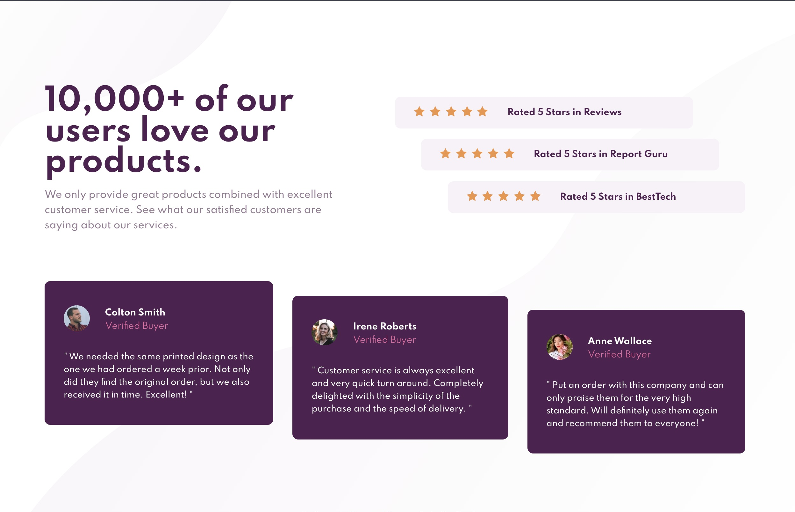

# Frontend Mentor - Social Proof Section solution

This is a solution to the [Social proof section challenge on Frontend Mentor](https://www.frontendmentor.io/challenges/social-proof-section-6e0qTv_bA). Frontend Mentor challenges help you improve your coding skills by building realistic projects.

## Table of contents

- [Overview](#overview)
  - [The challenge](#the-challenge)
  - [Screenshot](#screenshot)
  - [Links](#links)
- [My process](#my-process)
  - [Built with](#built-with)
- [Author](#author)

## Overview

### The challenge

Users should be able to:

- View the optimal layout for the site depending on their device's screen size

### Screenshots

### Links

- Live Site URL: [Social proof section](https://social-proof-section-matthiassmith.vercel.app/)

## My process

### Built with

- Semantic HTML5 markup
- CSS (BEM naming convention)
- Mobile-first workflow
## Author

- Github - [Matthias Smith](https://github.com/MatthiasSmith)
- Frontend Mentor - [@MatthiasSmith](https://www.frontendmentor.io/profile/MatthiasSmith)